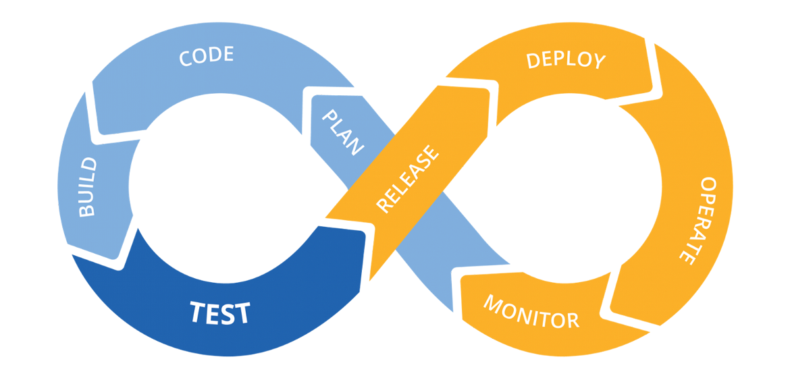

# CI/CD & GitOps



Bu mərhələdə GitHub Actions vasitəsilə tətbiqin avtomatik test edilməsi, imicin GHCR-ə push olunması, GitOps manifestlərinin yenilənməsi və ArgoCD App-of-Apps modeli ilə mühitlərin avtomatik sinxronizasiyası qurulur.

## Mühit
- Kubernetes cluster
- ArgoCD
- GitHub repository (packages enabled)

## Task addımları

### 1. `.github/workflows/ci.yaml` faylını yaradın.

#### 1.1. Workflow faylını və qovluğunu yaradın

```sh
mkdir -p .github/workflows
touch .github/workflows/ci.yaml
```

#### 1.2. Applikasiya spesifik dəyişəni repozitoriyaya əlavə edin

[New variable](https://github.com/Zynthasius39/dost-internship/settings/variables/actions/new)
```
Name: APP_NAME
Value: gopher
```

### 2. Workflow daxilində **Job 1 (lint-and-test)** qurun: `helm lint` yoxlamasını icra etsin.

```diff
+name: App & Chart Integration Pipeline
+
+on:
+  push:
+    branches: [ $default-branch ]
+  pull_request:
+    branches: [ $default-branch ]
+
+jobs:
+  helm-lint:
+    runs-on: ubuntu-latest
+    steps:
+      - name: Checkout code
+        uses: actions/checkout@v6
+
+      - name: Install helm
+        uses: azure/setup-helm@v5
+        id: install
+
+      - name: Lint Code Base
+        run: helm lint deploy/helm/gopher
```

### 3. **Job 2 (build-and-push)** qurun (yalnız main branch-da və job 1 uğurla keçərsə): imici build edin və GitHub Container Registry-ə (GHCR) push edin. Teq olaraq `latest` + `sha-${{ github.sha }}` istifadə edin.
### 5. GHCR tokenini GitHub Secrets-ə əlavə edin və workflow daxilində `secrets.GITHUB_TOKEN` vasitəsilə istifadə edin.

```diff
@@ -19,3 +19,37 @@
jobs:

+  build-image:
+    runs-on: ubuntu-latest
+    needs: helm-lint
+    permissions:
+      packages: write
+    steps:
+      - name: Checkout code
+        uses: actions/checkout@v6
+
+      - name: Log in to the Container registry
+        uses: docker/login-action@v4
+        with:
+          registry: ghcr.io
+          username: ${{ github.actor }}
+          password: ${{ secrets.GITHUB_TOKEN }}
+
+      - name: Extract Docker metadata
+        id: meta
+        uses: docker/metadata-action@v6
+        with:
+          images: ghcr.io/${{ github.actor }}/${{ vars.APP_NAME }}
+          tags: |
+            type=raw,value=latest
+            type=sha,format=long
+
+      - name: Build and push Docker image
+        id: push
+        uses: docker/build-push-action@v7
+        with:
+          context: src/${{ vars.APP_NAME }}
+          push: true
+          tags: ${{ steps.meta.outputs.tags }}
+          labels: ${{ steps.meta.outputs.labels }}
```

### 4. **Job 3 (update-chart)** qurun (job 2 bitdikdən sonra): `values-prod.yaml` faylındakı `image.tag` dəyərini yeni SHA ilə dəyişdirin, commitsiz dövrə girməmək üçün `[skip ci]` ifadəsi ilə commit edib repozitoriyaya geri push edin.

```diff
@@ -52,3 +52,24 @@ jobs:
           push: true
           tags: ${{ steps.meta.outputs.tags }}
           labels: ${{ steps.meta.outputs.labels }}
+
+  update-chart:
+    runs-on: ubuntu-latest
+    needs: build-image
+    permissions:
+      contents: write
+    steps:
+      - name: Checkout code
+        uses: actions/checkout@v6
+
+      - name: Update Image Tag in values-prod.yaml
+        run: yq -i '.image.tag = "sha-${{ github.sha }}"' deploy/helm/${{ vars.APP_NAME }}/values-prod.yaml
+
+      - name: Commit and Push Changes
+        run: |
+          git config --global user.name "github-actions[bot]"
+          git config --global user.email "41898282+github-actions[bot]@users.noreply.github.com"
+          
+          git add deploy/helm/${{ vars.APP_NAME }}/values-prod.yaml
+          git commit -m "chore(ci): bump image tag to sha-${{ github.sha }} [skip ci]"
+          git push origin "$GITHUB_REF_NAME"
```

### 6. Pipeline status badge-ini `README.md` faylına əlavə edin.

#### 6.1. GitHub-da repozitoriyanın **Actions** səhifəsinə keçid edin.

#### 6.2. Sol paneldə yaratdığımız workflow-u seçin.

#### 6.3. Səhifənin sağ tərəfində, "Filter workflow runs" sahəsinin yanında açılan menyunu klikləyib **Create status badge** seçin.

#### 6.4. **Copy status badge Markdown** düyməsini klikləyin və markdown-u `README.md` faylına əlavə edin.

```diff
@@ -1,5 +1,7 @@
 # DOST Internship
 
+[](https://github.com/Zynthasius39/dost-internship/actions/workflows/ci.yaml)
+
```

### 7. ArgoCD-ni Kubernetes klasterinə qurun.

#### 7.1. ArgoCD namespace-ini yaradın və manifesti tətbiq edin

```sh
kubectl create namespace argocd
kubectl apply -n argocd --server-side --force-conflicts -f https://raw.githubusercontent.com/argoproj/argo-cd/stable/manifests/install.yaml
```

#### 7.2. ArgoCD pod-larının hazır olmasını gözləyin

```sh
kubectl -n argocd get pods
```
```console
NAME                                               READY   STATUS    RESTARTS   AGE
argocd-application-controller-0                    1/1     Running   0          56s
argocd-applicationset-controller-b7669f646-4kglt   1/1     Running   0          57s
argocd-dex-server-569b757-sznj9                    1/1     Running   0          57s
argocd-notifications-controller-58ff87546-42k7v    1/1     Running   0          57s
argocd-redis-b9496d8bf-5r9sd                       1/1     Running   0          57s
argocd-repo-server-75ffcfc9df-dhckb                1/1     Running   0          57s
argocd-server-76755b46f8-z48kp                     1/1     Running   0          56s
```

#### 7.3. ArgoCD Server-in daxili TLS-ini söndürün

Ingress arxasında işlədiyi üçün ArgoCD-nin öz TLS-ini deaktiv etmək lazımdır.

```sh
kubectl -n argocd patch configmap argocd-cmd-params-cm --type merge -p '{"data":{"server.insecure":"true"}}'
kubectl -n argocd rollout restart deployment argocd-server
kubectl -n argocd rollout status deployment argocd-server
```

#### 7.4. ArgoCD üçün DNS rekordu yaradın

```hcl
resource "dns_a_record_set" "dns_naquadah_a_argocd" {
  addresses = ["10.0.20.1"]
  name      = "argocd"
  ttl       = 300
  zone      = "naquadah.alak."
}
```

#### 7.4. ArgoCD Server-i Ingress ilə expose edin

_[argocd-ingress.yaml](../deploy/argocd-ingress.yaml)_
```yaml
---
apiVersion: networking.k8s.io/v1
kind: Ingress
metadata:
  name: argocd-server
  namespace: argocd
  labels:
    service.kubernetes.io/advertise-bgp: "true"
spec:
  ingressClassName: cilium
  rules:
    - host: argocd.naquadah.alak
      http:
        paths:
          - path: /
            pathType: Prefix
            backend:
              service:
                name: argocd-server
                port:
                  number: http
  tls:
    - hosts:
        - argocd.naquadah.alak
```

### 8. ArgoCD UI-a daxil olun və default admin şifrəsini dəyişdirin.

#### 8.1. İlkin admin şifrəsini əldə edin

```sh
kubectl -n argocd get secret argocd-initial-admin-secret -o jsonpath="{.data.password}" | base64 -d; echo
```

#### 8.2. ArgoCD CLI vasitəsilə login olun

```sh
argocd login argocd.naquadah.alak --username admin --password <initial-password> --grpc-web
```

#### 8.3. Admin şifrəsini dəyişdirin

```sh
argocd account update-password --current-password <initial-password> --new-password <new-password>
```

#### 8.4. İlkin admin secret-ini silin

```sh
kubectl -n argocd delete secret argocd-initial-admin-secret
```

### 9. `deploy/apps/dev-app.yaml` manifestini yazın — `source: helm/gopher`, `valueFiles: [values.yaml, values-dev.yaml]`, `namespace: gopher-dev`, `syncPolicy: automated + selfHeal + prune`.

#### 9.1. Qovluq strukturunu yaradın

```sh
mkdir -p deploy/apps
```

#### 9.2. Dev mühiti üçün ArgoCD Application manifestini yazın

_[dev-app.yaml](../deploy/argocd/apps/dev-app.yaml)_
```diff
@@ -0,0 +1,28 @@
+ apiVersion: argoproj.io/v1alpha1
+ kind: Application
+ metadata:
+   name: gopher-dev
+   namespace: argocd
+ spec:
+   project: default
+   source:
+     repoURL: https://github.com/Zynthasius39/dost-internship.git
+     targetRevision: HEAD
+     path: deploy/helm/gopher
+     helm:
+       valueFiles:
+         - values.yaml
+         - values-dev.yaml
+   destination:
+     server: https://kubernetes.default.svc
+     namespace: gopher-dev
+   syncPolicy:
+     automated:
+       selfHeal: true
+       prune: true
+     syncOptions:
+       - CreateNamespace=true
```

### 10. `deploy/apps/prod-app.yaml` manifestini yazın — eyni struktur ilə, fərqli olaraq `values-prod.yaml` və `namespace: gopher-prod` istifadə edin.

_[prod-app.yaml](../deploy/argocd/apps/prod-app.yaml)_
```diff
@@ -0,0 +1,28 @@
+ apiVersion: argoproj.io/v1alpha1
+ kind: Application
+ metadata:
+   name: gopher-prod
+   namespace: argocd
+ spec:
+   project: default
+   source:
+     repoURL: https://github.com/Zynthasius39/dost-internship.git
+     targetRevision: HEAD
+     path: deploy/helm/gopher
+     helm:
+       valueFiles:
+         - values.yaml
+         - values-prod.yaml
+   destination:
+     server: https://kubernetes.default.svc
+     namespace: gopher-prod
+   syncPolicy:
+     automated:
+       selfHeal: true
+       prune: true
+     syncOptions:
+       - CreateNamespace=true
```

### 11. `deploy/root-app.yaml` manifestini yazın (App-of-Apps modeli) və `deploy/apps/` qovluğunu hədəf göstərin.

_[root-app.yaml](../deploy/argocd/root-app.yaml)_
```diff
@@ -0,0 +1,22 @@
+ apiVersion: argoproj.io/v1alpha1
+ kind: Application
+ metadata:
+   name: root-app
+   namespace: argocd
+ spec:
+   project: default
+   source:
+     repoURL: https://github.com/Zynthasius39/dost-internship.git
+     targetRevision: HEAD
+     path: deploy/argocd/apps
+   destination:
+     server: https://kubernetes.default.svc
+     namespace: argocd
+   syncPolicy:
+     automated:
+       selfHeal: true
+       prune: true
```

### 12. Klasterdə yalnız `kubectl apply -f deploy/root-app.yaml` əmrini icra edin; qalan bütün resursların idarəçiliyini ArgoCD-yə buraxın.

#### 12.1. Root Application-u tətbiq edin

```sh
kubectl apply -f deploy/root-app.yaml
```

#### 12.2. ArgoCD-nin bütün Application-ları sinxronlaşdırdığını təsdiq edin

```sh
kubectl -n argocd get applications
```
```console
NAME          SYNC STATUS   HEALTH STATUS
root-app      Synced        Healthy
gopher-dev    Synced        Healthy
gopher-prod   Synced        Healthy
```

#### 12.3. Yazdığımız namespace-lərdə resursların yarandığını yoxlayın

```sh
kubectl -n gopher-dev get all
kubectl -n gopher-prod get all
```

Bundan sonra bütün Helm chart dəyişiklikləri (image tag yenilənməsi, replica sayı, ingress konfiqurasiyası və s.) yalnız Git repozitoriyası vasitəsilə idarə olunur — ArgoCD avtomatik olaraq klasterin vəziyyətini Git-dəki manifest-lərlə sinxronlaşdırır.
