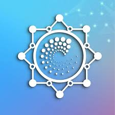

# DOST Internship

## 01-openssl-pki | Fərdi OpenSSL PKI infrastrukturu
- [**Tapşırıq izahları**](01-openssl-pki/README.md)
- [Dəyişdirilməmiş ilkin tapşırıqlar](01-openssl-pki/TODO.md)
- [OpenSSL bələdçisi](01-openssl-pki/openssl/README.md)
- [VM provision skriptləri](01-openssl-pki/virt-scripts/README.md)
- [Brauzer testləri üçün skriptlər](01-openssl-pki/browser-testing/README.md)

## 02-docker-compose | Docker Compose 
- [**Tapşırıq izahları**](02-docker-compose/README.md)
- [Dəyişdirilməmiş ilkin tapşırıqlar](02-docker-compose/TODO.md)

## 03-kubernetes-cluster | Kubernetes Klasteri
- [**Tapşırıq izahları**](03-kubernetes-cluster/README.md)
- [Dəyişdirilməmiş ilkin tapşırıqlar](03-kubernetes-cluster/TODO.md)

## 04-k8s-gateway-monitoring-scaling | Kubernetes üzərində tətbiq çatdırılması və müşahidəsi
- [**Tapşırıq izahları**](04-k8s-gateway-monitoring-scaling/README.md)
- [Dəyişdirilməmiş ilkin tapşırıqlar](04-k8s-gateway-monitoring-scaling/TODO.md)

## 05-app-and-packaging | Tətbiq və paketlənmə
- [**Tapşırıq izahları**](05-app-and-packaging/README.md)
- [Dəyişdirilməmiş ilkin tapşırıqlar](05-app-and-packaging/TODO.md)

## 06-cicd-and-gitops | CI/CD və GitOps
- [**Tapşırıq izahları**](06-cicd-and-gitops/README.md)
- [Dəyişdirilməmiş ilkin tapşırıqlar](06-cicd-and-gitops/TODO.md)

## 07-observability | Müşahidə imkanları (Observability)
- [**Tapşırıq izahları**](07-observability/README.md)
- [Dəyişdirilməmiş ilkin tapşırıqlar](07-observability/TODO.md)

## 08-alerting-and-load-testing | Xəbərdarlıq sistemi və yük testləri
- [**Tapşırıq izahları**](08-alerting-and-load-testing/README.md)
- [Dəyişdirilməmiş ilkin tapşırıqlar](08-alerting-and-load-testing/TODO.md)

## 09-resilience-and-validation | Dayanıqlılıq və yoxlama
- [**Tapşırıq izahları**](09-resilience-and-validation/README.md)
- [Dəyişdirilməmiş ilkin tapşırıqlar](09-resilience-and-validation/TODO.md)

## 10-final-verification | Yekun təsdiqləmə (Final verification)
- [**Tapşırıq izahları**](10-final-verification/README.md)
- [Dəyişdirilməmiş ilkin tapşırıqlar](10-final-verification/TODO.md)

## 99-journal | Gündəlik
- [**İş günləri və tapşırıqlar**](JOURNAL.md)

# Repozitoriya Strukturu

Bu repozitoriyada qarşılaşacağınız tapşırıqlar iki fərqli xarakter daşıyır:
1. **Standalone Labs:** `01-04` arası bəzi tapşırıqlar sırf konseptual mənimsəmə xarakterlidir və yekun tətbiq infrastrukturuna daxil deyil.
2. **Project Pipeline:** `05-10` arası tapşırıqlar isə bir-biri ilə tam əlaqəlidir.
