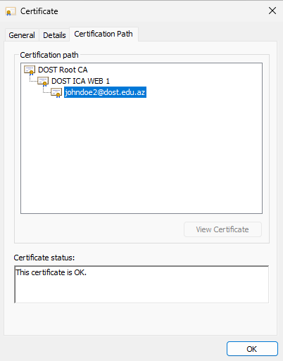
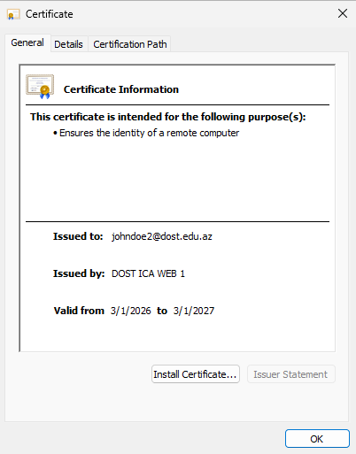
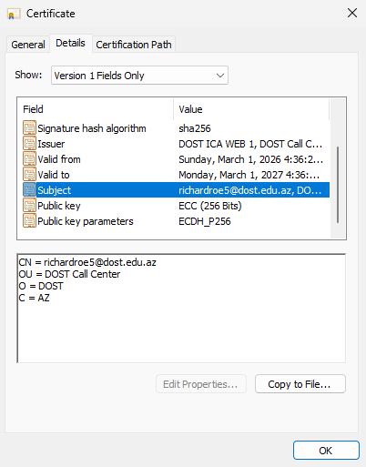
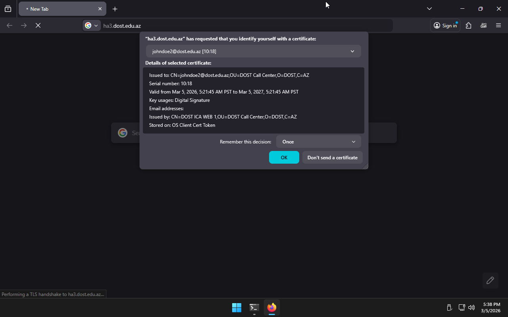
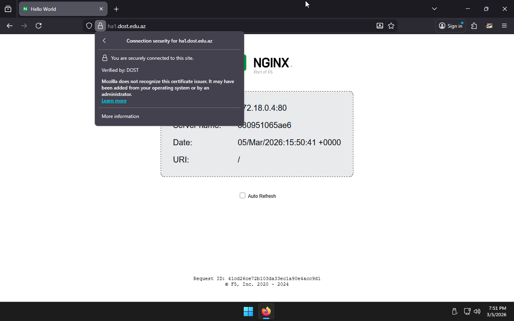
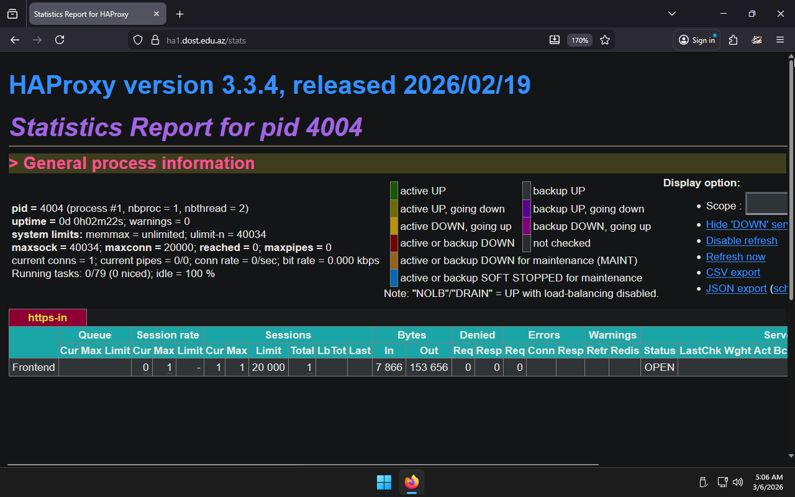
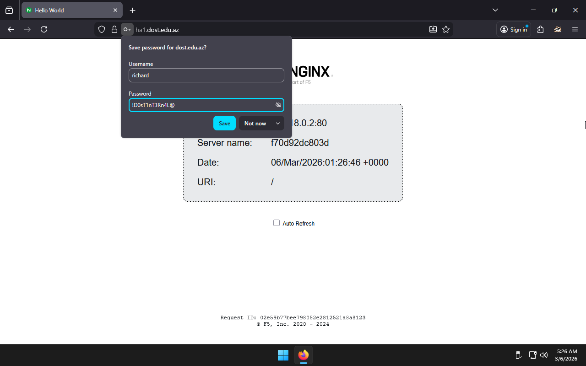

# Task list
Tasks reordered and rewritten for clarity

---
<!-- toc -->

- [Task list](#task-list)
  - [1.1. Setting up a
    PKI](#11-setting-up-a-pki)
    - [Install **openssl**](#install-openssl)
    - [Set PKI](#set-pki)
    - [Create PKI hierarchy
      directories](#create-pki-hierarchy-directories)
    - [Create serial files to keep track of issued and revoked
      certificates](#create-serial-files-to-keep-track-of-issued-and-revoked-certificates)
    - [Create a text file to be used as a database for all
      certificates](#create-a-text-file-to-be-used-as-a-database-for-all-certificates)
    - [Create an OpenSSL configuration
      template](#create-an-openssl-configuration-template)
    - [Render the OpenSSL
      configuration](#render-the-openssl-configuration)
  - [1.2. Create Root-CA and
    Inter-CA](#12-create-root-ca-and-inter-ca)
    - [Root-CA](#root-ca)
      - [Generate a private key for CA using one the
        commands](#generate-a-private-key-for-ca-using-one-the-commands)
      - [Secure the private
        key](#secure-the-private-key)
      - [Generate CA
        certificate](#generate-ca-certificate)
    - [Intermediate-CA](#intermediate-ca)
      - [Set ICA](#set-ica)
      - [Generate private keys for
        Inter-CA](#generate-private-keys-for-inter-ca)
      - [Secure the private
        keys](#secure-the-private-keys)
      - [Generate a Certificate Request
        (CSR)](#generate-a-certificate-request-csr)
      - [Sign the CSR](#sign-the-csr)
  - [1.3. 1.8. 1.9. Sign 2 server and 2 client
    certificates](#13-18-19-sign-2-server-and-2-client-certificates)
  - [1.10. Server certificates on a Windows
    machine](#110-server-certificates-on-a-windows-machine)
    - [Run the script to generate the
      certificates](#run-the-script-to-generate-the-certificates)
  - [2.1. Create 2 servers for
    HAProxy](#21-create-2-servers-for-haproxy)
  - [1.6. Install **socat**](#16-install-socat)
  - [1.4. Install
    **haproxy**](#14-install-haproxy)
  - [2.3. 2.4. Install second HAProxy
    server](#23-24-install-second-haproxy-server)
    - [Install necessary packages on each
      server](#install-necessary-packages-on-each-server)
    - [Start **HAProxy**](#start-haproxy)
  - [1.7. Use this command
    `echo "show info"|socat stdio /var/lib/haproxy/stats`](#17-use-this-command-echo-show-infosocat-stdio-varlibhaproxystats)
    - [Redo Step: Sync HAProxy
      configuration](#redo-step-sync-haproxy-configuration)
  - [1.5. Configure web services (2 frontends and 2
    backends)](#15-configure-web-services-2-frontends-and-2-backends)
  - [2.4. Use similar configs for both HAProxy
    servers](#24-use-similar-configs-for-both-haproxy-servers)
    - [Create a docker-compose file on each server to deploy web
      applications for
      testing](#create-a-docker-compose-file-on-each-server-to-deploy-web-applications-for-testing)
    - [Bring up the
      containers](#bring-up-the-containers)
  - [1.16. Configure
    backends](#116-configure-backends)
  - [2.2. Configure TCP
    balancing](#22-configure-tcp-balancing)
    - [Add backends pointing to the web services running on the
      server.](#add-backends-pointing-to-the-web-services-running-on-the-server)
    - [Add a backend pointing to trust
      server.](#add-a-backend-pointing-to-trust-server)
    - [Sync HAProxy
      configuration](#sync-haproxy-configuration)
  - [1.10. Configure frontends with ssl and
    crl](#110-configure-frontends-with-ssl-and-crl)
  - [1.15. Add ACL for PATH BEGIN, PATH END , Source address, domin
    name,
    and](#115-add-acl-for-path-begin-path-end--source-address-domin-name-and)
    - [Transfer server certificates and private
      keys](#transfer-server-certificates-and-private-keys)
    - [Generate and transfer
      CRLs](#generate-and-transfer-crls)
    - [Add a frontend with
      https](#add-a-frontend-with-https)
      - [HAProxy-1](#haproxy-1)
      - [HAProxy-2](#haproxy-2)
    - [Redo Step: Sync HAProxy
      configuration](#redo-step-sync-haproxy-configuration-1)
  - [1.11. Revoke a client
    certificate](#111-revoke-a-client-certificate)
    - [Generate and transfer CAs
      chain](#generate-and-transfer-cas-chain)
    - [Redo Step: Generate and transfer
      CRLs](#redo-step-generate-and-transfer-crls)
    - [Configure HAProxy to enforce
      mTLS](#configure-haproxy-to-enforce-mtls)
    - [Redo Step: Sync HAProxy
      configuration](#redo-step-sync-haproxy-configuration-2)
    - [Generate a client
      certificate](#generate-a-client-certificate)
    - [Convert the client certificate to PKCS12
      format](#convert-the-client-certificate-to-pkcs12-format)
    - [Import the client certificate to
      Windows](#import-the-client-certificate-to-windows)
    - [Choose the imported certificate when asked in
      Firefox](#choose-the-imported-certificate-when-asked-in-firefox)
    - [Observe: mTLS working as
      expected](#observe-mtls-working-as-expected)
    - [Revoke the client
      certificate](#revoke-the-client-certificate)
    - [Update the CRLs on HAProxy
      servers](#update-the-crls-on-haproxy-servers)
      - [Redo Step: Generate and transfer
        CRLs](#redo-step-generate-and-transfer-crls-1)
    - [Observe: mTLS failed because of revoked client
      certificate](#observe-mtls-failed-because-of-revoked-client-certificate)
  - [1.12. Redirect all http requests to
    https](#112-redirect-all-http-requests-to-https)
    - [Configure an http
      frontend](#configure-an-http-frontend)
  - [1.13. Configure stats page with password
    auth](#113-configure-stats-page-with-password-auth)
    - [Configure a stats
      section](#configure-a-stats-section)
    - [Redo Step: Sync HAProxy
      configuration](#redo-step-sync-haproxy-configuration-3)
  - [1.14. Configure basic
    auth](#114-configure-basic-auth)
  - [1.14.1 with unsecure
    password](#1141-with-unsecure-password)
  - [1.14.2 with encrypted
    password](#1142-with-encrypted-password)
    - [Hash a password using
      SHA-512](#hash-a-password-using-sha-512)
    - [Configure userlist and an ACL
      rule](#configure-userlist-and-an-acl-rule)
  - [1.15. Configure ACL
    rules](#115-configure-acl-rules)
  - [2.2. Configure TCP load
    balancing](#22-configure-tcp-load-balancing)
    - [Confugre HAProxy with a TCP frontend and a
      backend](#confugre-haproxy-with-a-tcp-frontend-and-a-backend)
    - [Redo Step: Sync HAProxy
      configuration](#redo-step-sync-haproxy-configuration-4)
  - [2.5. Install **keepalived** on the
    servers](#25-install-keepalived-on-the-servers)
  - [2.6. Configure a Virtual IP with
    healthcheck](#26-configure-a-virtual-ip-with-healthcheck)
  - [2.7. Point a domain to the Virtual
    IP](#27-point-a-domain-to-the-virtual-ip)
    - [Install
      **keepalived**](#install-keepalived)
    - [Generate a new server
      certificate](#generate-a-new-server-certificate)
    - [Transfer the server certificate to both
      servers](#transfer-the-server-certificate-to-both-servers)
    - [Configure both servers to accept connections with the new host
      header](#configure-both-servers-to-accept-connections-with-the-new-host-header)
    - [Configure a health endpoint for keepalived
      check](#configure-a-health-endpoint-for-keepalived-check)
    - [Redo Step: Sync HAProxy
      configuration](#redo-step-sync-haproxy-configuration-5)
    - [Configure KeepaliveD on the
      servers](#configure-keepalived-on-the-servers)
      - [HAProxy-1](#haproxy-1-1)
      - [HAProxy-2](#haproxy-2-1)
    - [Enable KeepaliveD
      service](#enable-keepalived-service)
    - [Observe: Virtual IP on master
      server](#observe-virtual-ip-on-master-server)
    - [Observe: KeepaliveD
      demo](#observe-keepalived-demo)
<!-- tocstop -->

---
## 1.1. Setting up a PKI

### Install **openssl**

Most of the linux distributions already ship with **openssl** package.
``` sh
# Debian Trixie
sudo apt update
sudo apt install -y openssl

# Arch Linux
sudo pacman -Syu
sudo pacman -S openssl

# AlmaLinux 10.1
sudo dnf install -y openssl
```

### Set PKI

``` sh
echo 'export PKI=$(pwd)/pki' >> ~/.bashrc
source ~/.bashrc
```

### Create PKI hierarchy directories

To store private keys, certificates, and etc.

``` sh
mkdir -vp "$PKI"/{root,ica/{web,vpn,internal}}/{certs,crl,newcerts,private,csr}
```

### Create serial files to keep track of issued and revoked certificates

``` sh
echo 1000 > "$PKI"/{root,ica/{web,vpn,internal}}/serial
echo 0100 > "$PKI"/{root,ica/{web,vpn,internal}}/crlnumber
```

### Create a text file to be used as a database for all certificates

``` sh
touch "$PKI"/{root,ica/{web,vpn,internal}}/index.txt
```

### Create an OpenSSL configuration template

``` sh
cat >openssl.cnf.tpl <<EOF
[ ca ]
default_ca = ica_web_ca

[ root_ca ]
dir               = \$ENV::PKI/root
certs             = \$dir/certs
crl_dir           = \$dir/crl
new_certs_dir     = \$dir/newcerts
database          = \$dir/index.txt
serial            = \$dir/serial
RANDFILE          = \$dir/private/.rand
private_key       = \$dir/private/ca.key
certificate       = \$dir/certs/ca.crt
crl               = \$dir/crl/ca.crl
crlnumber         = \$dir/crlnumber
crl_extensions    = crl_ext
default_days      = 7300
default_crl_days  = 30
default_md        = sha256
preserve          = no
email_in_dn       = no
name_opt          = ca_default
cert_opt          = ca_default
policy            = policy_strict
unique_subject    = no

[ ica_web_ca ]
dir               = \$ENV::PKI/ica/web
certs             = \$dir/certs
crl_dir           = \$dir/crl
new_certs_dir     = \$dir/newcerts
database          = \$dir/index.txt
serial            = \$dir/serial
RANDFILE          = \$dir/private/.rand
private_key       = \$dir/private/ica-web.key
certificate       = \$dir/certs/ica-web.crt
crl_extensions    = crl_ext
default_days      = 1825
default_crl_days  = 30
default_md        = sha256
policy            = policy_strict
x509_extensions   = server_cert
copy_extensions   = copy

[ ica_vpn_ca ]
dir               = \$ENV::PKI/ica/vpn
certs             = \$dir/certs
new_certs_dir     = \$dir/newcerts
database          = \$dir/index.txt
serial            = \$dir/serial
private_key       = \$dir/private/ica-vpn.key
certificate       = \$dir/certs/ica-vpn.crt
crl_extensions    = crl_ext
default_days      = 1825
default_crl_days  = 30
default_md        = sha256
policy            = policy_strict
x509_extensions   = usr_cert

[ ica_internal_ca ]
dir               = \$ENV::PKI/ica/internal
certs             = \$dir/certs
crl_dir           = \$dir/crl
new_certs_dir     = \$dir/newcerts
database          = \$dir/index.txt
serial            = \$dir/serial
private_key       = \$dir/private/ica-internal.key
certificate       = \$dir/certs/ica-internal.crt
crlnumber         = \$dir/crlnumber
crl_extensions    = crl_ext
default_days      = 1825
default_crl_days  = 30
default_md        = sha256
policy            = policy_strict
x509_extensions   = usr_cert

[ policy_strict ]
countryName             = match
stateOrProvinceName     = optional
organizationName        = match
organizationalUnitName  = optional
commonName              = supplied
emailAddress            = optional

[ req ]
default_bits        = 4096
distinguished_name  = req_distinguished_name
string_mask         = utf8only
default_md          = sha256
prompt              = no

[ req_distinguished_name ]
countryName                     = AZ
0.organizationName              = DOST
commonName                      = DOST Root CA

#
# Extensions
#

[ v3_ca ]
subjectKeyIdentifier = hash
authorityKeyIdentifier = keyid:always,issuer
basicConstraints = critical, CA:true
keyUsage = critical, keyCertSign, cRLSign

[ v3_intermediate_ca ]
subjectKeyIdentifier = hash
authorityKeyIdentifier = keyid:always,issuer
basicConstraints = critical, CA:true, pathlen:0
keyUsage = critical, keyCertSign, cRLSign
crlDistributionPoints  = URI:__CRL_URL__/crl/ca.crl
authorityInfoAccess = OCSP;URI:__CRL_URL__/ocsp

[ v3_ocsp ]
basicConstraints = CA:FALSE
keyUsage = nonRepudiation, digitalSignature, keyEncipherment
extendedKeyUsage = OCSPSigning

[ server_cert ]
subjectKeyIdentifier   = hash
authorityKeyIdentifier = keyid,issuer
basicConstraints       = CA:false
keyUsage               = critical, digitalSignature, keyEncipherment
extendedKeyUsage       = serverAuth
crlDistributionPoints  = URI:__CRL_URL__/crl/ica-web.crl
authorityInfoAccess = OCSP;URI:__CRL_URL__/ocsp

[ client_cert ]
subjectKeyIdentifier   = hash
authorityKeyIdentifier = keyid,issuer
basicConstraints       = CA:false
keyUsage               = critical, digitalSignature
extendedKeyUsage       = clientAuth
crlDistributionPoints  = URI:__CRL_URL__/crl/ica-web.crl
authorityInfoAccess = OCSP;URI:__CRL_URL__/ocsp

[ usr_cert ]
subjectKeyIdentifier    = hash
authorityKeyIdentifier  = keyid,issuer
basicConstraints        = CA:false
keyUsage                = critical, digitalSignature, keyEncipherment
extendedKeyUsage        = clientAuth
crlDistributionPoints   = URI:__CRL_URL__/crl/ica-web.crl
authorityInfoAccess = OCSP;URI:__CRL_URL__/ocsp

[ crl_ext ]
authorityKeyIdentifier = keyid:always,issuer
EOF
```

### Render the OpenSSL configuration

``` sh
CA_URL=http://ca.dost.edu.az
sed "s/__CRL_URL__/$(echo $CA_URL | sed 's/[\/&]/\\&/g')/g" openssl.cnf.tpl > openssl.cnf
```

## 1.2. Create Root-CA and Inter-CA

### Root-CA

#### Generate a private key for CA using one the commands

``` sh
openssl genpkey \
  -algorithm EC \
  -pkeyopt ec_paramgen_curve:P-256 \
  -out "$PKI/root/private/ca.key"

openssl genrsa \
  -out "$PKI/root/private/ca.key" \
  4096

openssl ecparam \
  -genkey \
  -name prime256v1 \
  -out "$PKI/root/private/ca.key"
```

#### Secure the private key

``` sh
chmod 400 "$PKI/root/private/ca.key"
```

#### Generate CA certificate

- Using v3_ca extensions
- Expiring in 20 years (for a Root-CA)
- Skipping certificate requesting

``` sh
openssl req \
  -config openssl.cnf \
  -extensions v3_ca \
  -key "$PKI/root/private/ca.key" \
  -new \
  -x509 \
  -days 7300 \
  -sha256 \
  -out "$PKI/root/certs/ca.crt"
```

### Intermediate-CA

#### Set ICA
``` sh
export ICA=web
```

#### Generate private keys for Inter-CA

``` sh
openssl genpkey \
  -algorithm EC \
  -pkeyopt ec_paramgen_curve:P-256 \
  -out "$PKI/ica/$ICA/private/ica-$ICA.key"
```

#### Secure the private keys

``` sh
chmod 400 "$PKI/ica/$ICA/private/ica-$ICA.key"
```

#### Generate a Certificate Request (CSR)

*countryName* and *organizationName* must **match** as we specified such
in the config

``` sh
openssl req \
  -new \
  -subj "/C=AZ/L=Baku/O=DOST/OU=DOST Call Center/CN=DOST ICA $(echo $ICA | tr '[:lower:]' '[:upper:]'
) 1" \
  -key "$PKI/ica/$ICA/private/ica-$ICA.key" \
  -out "$PKI/ica/$ICA/csr/ica-$ICA.csr"
```

#### Sign the CSR

Using v3_intermediate_ca extensions Expiring in 5 years (for an
Intermediate-CA)

``` sh
openssl ca \
  -config openssl.cnf \
  -name root_ca \
  -extensions v3_intermediate_ca \
  -batch \
  -notext \
  -days 1825 \
  -md sha256 \
  -in "$PKI/ica/$ICA/csr/ica-$ICA.csr" \
  -out "$PKI/ica/$ICA/certs/ica-$ICA.crt"
```

## 1.3. 1.8. 1.9. Sign 2 server and 2 client certificates
## 1.10. Server certificates on a Windows machine

### Run the script to generate the certificates

- Server certificate for ha1.dost.edu.az
- Server certificate for ha2.dost.edu.az
- Client certificate for johndoe2@dost.edu.az
- Client certificate for richardroe5@dost.edu.az

``` sh
### Server certificates
for SERVER_FQDN in ha1.dost.edu.az ha2.dost.edu.az
do
  # Generate a private key for Non-CA
  openssl genpkey \
    -algorithm EC \
    -pkeyopt ec_paramgen_curve:P-256 \
    -out "$PKI/ica/web/private/$SERVER_FQDN.key"

  # Secure the private key
  chmod 400 "$PKI/ica/web/private/$SERVER_FQDN.key"

  # Generate a Certificate Request (CSR)
  openssl req -new \
    -key "$PKI/ica/web/private/$SERVER_FQDN.key" \
    -subj "/C=AZ/L=Baku/O=DOST/OU=DOST Call Center/CN=$SERVER_FQDN" \
    -out "$PKI/ica/web/csr/$SERVER_FQDN.csr" \
    -addext "subjectAltName=DNS:$SERVER_FQDN"

  # Sign the CSR
  #
  # server_cert extensions
  # a year for a Non-CA
  openssl ca \
    -config openssl.cnf \
    -name ica_web_ca \
    -extensions server_cert \
    -batch \
    -notext \
    -days 365 \
    -md sha256 \
    -in "$PKI/ica/web/csr/$SERVER_FQDN.csr" \
    -out "$PKI/ica/web/certs/$SERVER_FQDN.crt"
done

### Client certificates
for CLIENT_SUBJ in johndoe2@dost.edu.az richardroe5@dost.edu.az
do
  # Generate a private key for Non-CA
  openssl genpkey \
    -algorithm EC \
    -pkeyopt ec_paramgen_curve:P-256 \
    -out "$PKI/ica/web/private/$CLIENT_SUBJ.key"

  # Secure the private key
  chmod 400 "$PKI/ica/web/private/$CLIENT_SUBJ.key"

  # Generate a Certificate Request (CSR)
  openssl req -new \
    -key "$PKI/ica/web/private/$CLIENT_SUBJ.key" \
    -subj "/C=AZ/L=Baku/O=DOST/OU=DOST Call Center/CN=$CLIENT_SUBJ" \
    -out "$PKI/ica/web/csr/$CLIENT_SUBJ.csr"

  # Sign the CSR
  #
  # server_cert extensions
  # a year for a Non-CA
  openssl ca \
    -config openssl.cnf \
    -name ica_web_ca \
    -extensions server_cert \
    -batch \
    -notext \
    -days 365 \
    -md sha256 \
    -in "$PKI/ica/web/csr/$CLIENT_SUBJ.csr" \
    -out "$PKI/ica/web/certs/$CLIENT_SUBJ.crt"
done
```






## 2.1. Create 2 servers for HAProxy
## 1.6. Install **socat**
## 1.4. Install **haproxy**
## 2.3. 2.4. Install second HAProxy server

### Install necessary packages on each server

``` sh
# Arch Linux
# [arch@haproxy-1 ~]$
sudo pacman -Syu
sudo pacman -S haproxy socat

# Debian Trixie
# debian@haproxy-2:~$
sudo apt update
sudo apt upgrade
sudo apt install -y haproxy socat
```

### Start **HAProxy**

``` sh
# [arch@haproxy-1 ~]$
# debian@haproxy-2:~$
systemctl enable --now haproxy
```

## 1.7. Use this command ```echo "show info"|socat stdio /var/lib/haproxy/stats```

Haproxy's stats socket is configured at ```/run/haproxy/admin.sock``` on Debian.
Added the following lines to the config file for it to be enabled on Arch.
```
global
  ...
  stats socket /run/haproxy/admin.sock mode 660 level admin
  stats timeout 30s

...
```

### Redo [Step: Sync HAProxy configuration](#sync-haproxy-configuration)

``` sh
# debian@haproxy-2:~$
echo "show info" | socat stdio /run/haproxy/admin.sock
```
``` console
Name: HAProxy
Version: 3.0.11-1+deb13u2
Release_date: 2026/02/11
Nbthread: 2
Nbproc: 1
Process_num: 1
Pid: 900
Uptime: 0d 1h03m48s
Uptime_sec: 3828
...
CumStreams: 4
BlockedTrafficWarnings: 0
```

## 1.5. Configure web services (2 frontends and 2 backends)
## 2.4. Use similar configs for both HAProxy servers

### Create a docker-compose file on each server to deploy web applications for testing

``` sh
# [almalinux@trust ~]$
for C in 1 2; do
  cat <<EOF | ssh haproxy-$C "tee docker-compose.yaml"
services:
  frontend-$((C*2-1)):
    image: nginxdemos/hello
    container_name: frontend-$((C*2-1))
    ports:
      - "8080:80"

  backend-$((C*2-1)):
    image: hashicorp/http-echo
    container_name: backend-$((C*2-1))
    command: ["-text=Hello from backend $((C*2-1))"]
    ports:
      - "3000:5678"

  frontend-$((C*2)):
    image: nginxdemos/hello
    container_name: frontend-$((C*2))
    ports:
      - "8081:80"

  backend-$((C*2)):
    image: hashicorp/http-echo
    container_name: backend-$((C*2))
    command: ["-text=Hello from backend $((C*2))"]
    ports:
      - "3001:5678"
EOF
done
```

``` sh
# debian@haproxy-2:~$
cat >docker-compose.yaml <<EOF
services:
  frontend-3:
    image: nginxdemos/hello
    container_name: frontend-3
    ports:
      - "8080:80"

  backend-3:
    image: hashicorp/http-echo
    container_name: backend-3
    command: ["-text=Hello from backend 3"]
    ports:
      - "3000:5678"

  frontend-4:
    image: nginxdemos/hello
    container_name: frontend-4
    ports:
      - "8081:80"

  backend-4:
    image: hashicorp/http-echo
    container_name: backend-4
    command: ["-text=Hello from backend 4"]
    ports:
      - "3001:5678"
EOF
```

### Bring up the containers

``` sh
# [arch@haproxy-1 ~]$
docker-compose up -d

# debian@haproxy-2:~$
docker compose up -d
```

## 1.16. Configure backends
## 2.2. Configure TCP balancing

### Add backends pointing to the web services running on the server.

I will be changing [haproxy/haproxy.cfg](haproxy/haproxy.cfg.tpl) from now on.
The template will be rendered and synced to servers.

Added to [haproxy/haproxy.cfg](haproxy/haproxy.cfg.tpl)
```
backend web-backend
  mode http
  balance roundrobin
  server web1 127.0.0.1:8080 check
  server web2 127.0.0.1:8081 check

backend api-backend
  mode tcp
  balance leastconn
  server api1 127.0.0.1:3000 check
  server api2 127.0.0.1:3001 check
```

### Add a backend pointing to trust server.

Added to [haproxy/haproxy.cfg](haproxy/haproxy.cfg.tpl)
```
backend ca-backend
  mode http
  server cas1 192.168.122.180:8000 check
```

### Sync HAProxy configuration

``` sh
# [almalinux@trust ~]$
./haproxy/sync-haproxy.sh
```

[haproxy/sync-haproxy.sh](haproxy/sync-haproxy.sh)
``` sh
#!/bin/sh

HAP_CA_DOMAIN=ca.dost.edu.az
HAP_VIP_DOMAIN=ha.dost.edu.az
for C in 1 2; do
  HAP_DOMAIN=ha$C.dost.edu.az
  cat haproxy/haproxy.cfg.tpl | \
    sed \
      -e "s/__HAP_CA_DOMAIN__/$HAP_CA_DOMAIN/g" \
      -e "s/__HAP_VIP_DOMAIN__/$HAP_VIP_DOMAIN/g" \
      -e "s/__HAP_DOMAIN__/$HAP_DOMAIN/g" | \
    ssh haproxy-$C "sudo tee /etc/haproxy/haproxy.cfg && sudo sudo systemctl reload haproxy" >/dev/null
done
```

## 1.10. Configure frontends with ssl and crl
## 1.15. Add ACL for PATH BEGIN, PATH END , Source address, domin name, and

### Transfer server certificates and private keys

``` sh
# [almalinux@trust ~]$
for C in 1 2; do
  cat ~/pki/ica/web/{certs,private}/ha$C.dost.edu.az.* | \
    ssh haproxy-$C "sudo mkdir -vp /etc/haproxy/certs && sudo tee /etc/haproxy/certs/ha$C.dost.edu.az.pem" >/dev/null
done
```

### Generate and transfer CRLs

Run periodically to keep CRLs updated
``` sh
# [almalinux@trust ~]$
export \
  CRLCHAIN="$(openssl ca -gencrl -config openssl.cnf -name root_ca)
$(openssl ca -gencrl -config openssl.cnf -name ica_web_ca)"

for C in 1 2; do
  echo "$CRLCHAIN" | \
    ssh haproxy-$C "sudo tee /etc/haproxy/crl-chain.crl && sudo systemctl reload haproxy" >/dev/null
done
```

### Add a frontend with https

- Configure HAProxy to use self-signed certificates
- Configure ACL rules to route frontend and backend requests
- Restrict access to its allocated domain

#### HAProxy-1
```
# haproxy.cfg
frontend https-in
  bind *:443 ssl crt /etc/haproxy/certs/

  acl valid_host hdr(host) -i ha1.dost.edu.az
  http-request deny deny_status 421 unless valid_host
```

#### HAProxy-2
```
# haproxy.cfg
...
frontend https-in
  bind *:443 ssl crt /etc/haproxy/certs/

  acl valid_host hdr(host) -i ha2.dost.edu.az
  http-request deny deny_status 421 unless valid_host

...
```

### Redo [Step: Sync HAProxy configuration](#sync-haproxy-configuration)

## 1.11. Revoke a client certificate

> [!WARNING]
> HAProxy should verify client certificates for us
> to see the result of a revoked client certificate
> which was not specified in any of the tasks.

### Generate and transfer CAs chain

``` sh
# [almalinux@trust ~]$
for C in 1 2; do
  echo "$(<"$PKI/ica/web/certs/ica-web.crt")
$(<"$PKI/root/certs/ca.crt")" | \
    ssh haproxy-$C "sudo tee /etc/haproxy/ca-chain.crt" >/dev/null
done
```

### Redo [Step: Generate and transfer CRLs](#generate-and-transfer-crls)

### Configure HAProxy to enforce mTLS

- HAProxy will request a client certificate which will be verified against CAs
- CA certificates must be chained together (Inter-CA, CA)
- Updated CRLs must be provided to verify against
- CRLs also must be chained together (Inter-CA, CA)

Comment the old _bind_ line and add the new one
```
# haproxy.cfg
...
frontend https-in
  # bind *:443 ssl crt /etc/haproxy/certs/
  bind *:443 ssl crt /etc/haproxy/certs/ ca-file /etc/haproxy/ca-chain.crt verify required crl-file /etc/haproxy/crl-chain.crl

  ...

...
...
```

### Redo [Step: Sync HAProxy configuration](#sync-haproxy-configuration)

### Generate a [client certificate](openssl/README.md#client-certificate)

``` sh
# [almalinux@trust ~]$
# Client identifier
CLIENT_SUBJ=johndoe2@dost.edu.az

# Private key
openssl genpkey \
  -algorithm EC \
  -pkeyopt ec_paramgen_curve:P-256 \
  -out "$PKI/ica/web/private/$CLIENT_SUBJ.key"

# Secure the private key
chmod 400 "$PKI/ica/web/private/$CLIENT_SUBJ.key"

# Certificate Request
openssl req -new \
  -key "$PKI/ica/web/private/$CLIENT_SUBJ.key" \
  -subj "/C=AZ/L=Baku/O=DOST/OU=DOST Call Center/CN=$CLIENT_SUBJ" \
  -out "$PKI/ica/web/csr/$CLIENT_SUBJ.csr"

# Sign the CSR
openssl ca \
  -config openssl.cnf \
  -name ica_web_ca \
  -extensions client_cert \
  -batch \
  -notext \
  -days 365 \
  -md sha256 \
  -in "$PKI/ica/web/csr/$CLIENT_SUBJ.csr" \
  -out "$PKI/ica/web/certs/$CLIENT_SUBJ.crt"
```

### Convert the client certificate to PKCS12 format

``` sh
# [almalinux@trust ~]$
# Client identifier
CLIENT_SUBJ=johndoe2@dost.edu.az

openssl pkcs12 -export \
  -in "$PKI/ica/web/certs/$CLIENT_SUBJ.crt" \
  -inkey "$PKI/ica/web/private/$CLIENT_SUBJ.key" \
  -certfile "$PKI/ca-chain.crt" \
  -out $CLIENT_SUBJ.p12 \
  -passout pass: \
  -name "$(echo $CLIENT_SUBJ | awk -F@ '{ print $1 }')"
```

### Import the client certificate to Windows


### Choose the imported certificate when asked in Firefox


### Observe: mTLS working as expected


### [Revoke](openssl/README.md#revoke-a-certificate) the client certificate

``` sh
# [almalinux@trust ~]$
# Client identifier
CLIENT_SUBJ=johndoe2@dost.edu.az

openssl ca \
  -config openssl.cnf \
  -name ica_web_ca \
  -revoke "$PKI/ica/web/certs/$CLIENT_SUBJ.crt"

rm -f "$PKI/ica/web/private/$CLIENT_SUBJ.key"
```

### Update the CRLs on HAProxy servers

#### Redo [Step: Generate and transfer CRLs](#generate-and-transfer-crls)

### Observe: mTLS failed because of revoked client certificate

Firefox could not complete the request.
Chrome shows an error message.


Error message in HAProxy:
```
# journalctl -xeu haproxy
192.168.122.225:58143 [07/Mar/2026:16:41:50.353] https-in/2: SSL client certificate not trusted
```

## 1.12. Redirect all http requests to https

### Configure an http frontend

Redirect all to HTTPS except those with the header of ```Host: ca.dost.edu.az```.
http://ca.dost.edu.az is used to serve OSCP requests and CRLs
```
# haproxy.cfg
...
frontend http-in
  bind *:80
  mode http

  acl host_ca hdr(host) -i ca.dost.edu.az

  http-request redirect scheme https code 301 unless host_ca
  default_backend ca-backend

...
```

## 1.13. Configure stats page with password auth

### Configure a stats section
```
# haproxy.cfg
...
frontend https-in
  ...
  stats enable
  stats uri /stats
  stats realm HAProxy\ Statistics
  stats auth dostadmin:123
  stats refresh 10s

  ...

...
```

### Redo [Step: Sync HAProxy configuration](#sync-haproxy-configuration)




## 1.14. Configure basic auth
## 1.14.1 with unsecure password
## 1.14.2 with encrypted password

### Hash a password using SHA-512

``` sh
openssl passwd -6 '!D0sT1nT3Rn4L@'
```
``` console
$6$6PwCRmIvUBNQ6dcf$43EhoVB5/ODUU.wDMFYDhesYWMRnIy6OT8BPhTR5pGw0R5WBk47YBjr27z7GnU/EFOLDtgpPv5EdELE1cJ3wY/
```

### Configure userlist and an ACL rule
```
# haproxy.cfg
...
userlist dostlar
  user joe     insecure-password joespassword
  user richard password          $6$6PwCRmIvUBNQ6dcf$43EhoVB5/ODUU.wDMFYDhesYWMRnIy6OT8BPhTR5pGw0R5WBk47YBjr27z7GnU/EFOLDtgpPv5EdELE1cJ3wY/

...
frontend https-in
  ...
  acl auth_ok http_auth(dostlar)
	http-request auth realm AuthedHAP if !auth_ok

  ...

...
...
```

## 1.15. Configure ACL rules

```
...
frontend https-in
  ...
  # Source IP
  acl is_local src 192.168.122.0/24
  http-request return status 200 content-type "text/plain" string "Is from libvirt network" if is_local

  # Host header
  acl valid_host hdr(host) -i ha1.dost.edu.az
  http-request deny deny_status 421 unless valid_host

  # Path beginning
  acl is_api path_beg /api
  use_backend api-backend if is_api

  # Path ending
  acl is_img path_end .jpg
  http-request return status 200 content-type "text/plain" string "Static image server" if is_img
```

## 2.2. Configure TCP load balancing

### Confugre HAProxy with a TCP frontend and a backend

```
...
frontend tcp-in
  bind *:8000
  mode tcp
  default_backend tcp-backend

...

backend tcp-backend
  mode tcp
  balance roundrobin
  server web1 127.0.0.1:8080 check
  server web2 127.0.0.1:8081 check

...
```

### Redo [Step: Sync HAProxy configuration](#sync-haproxy-configuration)




## 2.5. Install **keepalived** on the servers
## 2.6. Configure a Virtual IP with healthcheck
## 2.7. Point a domain to the Virtual IP

### Install **keepalived**

``` sh
# Debian Trixie
sudo apt install -y keepalived

# Arch Linux
sudo pacman -S keepalived

# AlmaLinux 10.1
sudo dnf install -y keepalived
```

### Generate a new server certificate

https://ha.dost.edu.az will now resolve to 192.168.122.100 (Virtual IP)
``` sh
# [almalinux@trust ~]$
export SERVER_FQDN=ha.dost.edu.az

openssl genpkey \
  -algorithm EC \
  -pkeyopt ec_paramgen_curve:P-256 \
  -out "$PKI/ica/web/private/$SERVER_FQDN.key"

# Secure the private key
chmod 400 "$PKI/ica/web/private/$SERVER_FQDN.key"

# Generate a Certificate Request (CSR)
#
# (Optional) Add IP SAN
openssl req -new \
  -key "$PKI/ica/web/private/$SERVER_FQDN.key" \
  -subj "/C=AZ/L=Baku/O=DOST/OU=DOST Call Center/CN=$SERVER_FQDN" \
  -out "$PKI/ica/web/csr/$SERVER_FQDN.csr" \
  -addext "subjectAltName=DNS:$SERVER_FQDN,IP:192.168.122.100"

# Sign the CSR
#
# server_cert extensions
# a year for a Non-CA
openssl ca \
  -config openssl.cnf \
  -name ica_web_ca \
  -extensions server_cert \
  -batch \
  -notext \
  -days 365 \
  -md sha256 \
  -in "$PKI/ica/web/csr/$SERVER_FQDN.csr" \
  -out "$PKI/ica/web/certs/$SERVER_FQDN.crt"
```

### Transfer the server certificate to both servers

``` sh
# [almalinux@trust ~]$
for C in 1 2; do
  cat ~/pki/ica/web/{certs,private}/ha.dost.edu.az.* | \
    ssh haproxy-$C "sudo mkdir -vp /etc/haproxy/certs &&
sudo tee /etc/haproxy/certs/ha.dost.edu.az.pem &&
sudo systemctl reload haproxy" >/dev/null
done
```

### Configure both servers to accept connections with the new host header

```
...
frontend https-in
  ...
  acl valid_host hdr(host) -i ha.dost.edu.az
  http-request deny deny_status 421 unless valid_host

  ...

...
```

### Configure a health endpoint for keepalived check

```
...
frontend http-in
  ...
  acl path_health path_beg /health
  http-request return status 200 content-type "text/plain" string "OK" if path_health

  ...
...
```

### Redo [Step: Sync HAProxy configuration](#sync-haproxy-configuration)

### Configure KeepaliveD on the servers

#### HAProxy-1

```
# keepalived.conf
vrrp_script chk_haproxy {
	script "curl -sf http://127.0.0.1/health"
	interval 2
	weight -20
}

vrrp_instance VI_1 {
    state MASTER
    interface eth0
    virtual_router_id 51
    priority 100
    advert_int 1

    virtual_ipaddress {
        192.168.122.100/24
    }
}
```

#### HAProxy-2
```
# keepalived.conf
vrrp_script chk_haproxy {
	script "curl -sf http://127.0.0.1/health"
	interval 2
	weight -20
}

vrrp_instance VI_1 {
    state BACKUP
    interface enp1s0
    virtual_router_id 51
    priority 95
    advert_int 1

    virtual_ipaddress {
        192.168.122.100/24
    }
}
```

We can also store _keepalived_ in a template file: [haproxy/keepalived.conf.tpl](haproxy/keepalived.conf.tpl)
Render and sync with the script: [haproxy/sync-keepalived.sh](haproxy/keepalived.conf.tpl)

### Enable KeepaliveD service

``` sh
# [arch@haproxy-1 ~]$
# debian@haproxy-2:~$
sudo systemctl enable --now keepalived
```

### Observe: Virtual IP on master server

``` sh
# [arch@haproxy-1 ~]$
ip -br a
```

``` console
...
eth0             UP             192.168.122.156/24 metric 1024 192.168.122.100/24 fe80::5054:ff:fecd:ebc9/64 
...
```

### Observe: KeepaliveD demo

``` sh
while true; do sleep 1; curl https://ha.dost.edu.az/api; done
```

``` console
Hello from backend 1
Hello from backend 1
Hello from backend 1
Hello from backend 2  # Load balancing backends on HAProxy-1
Hello from backend 1
Hello from backend 2
Hello from backend 1
--------------------  # Stopping HAProxy service
curl: (7) Failed to connect to ha.dost.edu.az port 443 after 1 ms: Could not connect to server
curl: (7) Failed to connect to ha.dost.edu.az port 443 after 2 ms: Could not connect to server
curl: (7) Failed to connect to ha.dost.edu.az port 443 after 2 ms: Could not connect to server
curl: (7) Failed to connect to ha.dost.edu.az port 443 after 1 ms: Could not connect to server
Hello from backend 3
Hello from backend 4
Hello from backend 3
Hello from backend 4
Hello from backend 3
Hello from backend 4
Hello from backend 3
Hello from backend 4
Hello from backend 3  # Load balancing backends on HAProxy-2
Hello from backend 4
Hello from backend 3
Hello from backend 4
Hello from backend 3
Hello from backend 4
Hello from backend 3
Hello from backend 4
Hello from backend 3
Hello from backend 4
--------------------  # Starting HAProxy service
Hello from backend 2
Hello from backend 1
Hello from backend 1
Hello from backend 2
Hello from backend 1
Hello from backend 1
```
